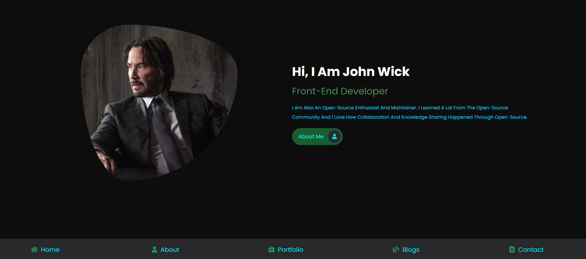

# Front-end-dev-portfolio

A front-end web developer is responsible for implementing visual and interactive elements that users engage with through their web browser when using a web application. ... A front-end web developer is responsible for implementing visual elements that users see and interact with in a web application.

# Feature
Only Html And CSS Based Project. 

Pages:
- Home 
- About
- Portfolio
- Blogs
- Contact

# Demo
[Youtube](https://youtu.be/BNOTvGjRj3A)

# Contribution
Open To Fork, Give Give Me a Simple credit
